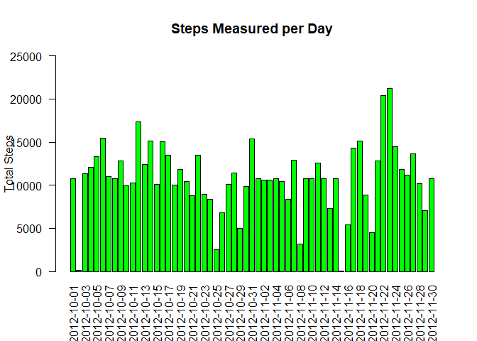

Note: Uses render() in rmarkdown instead of knitr, as latest RStudio uses RMarkdown v2 by default

## Loading and preprocessing the data


Loading required modules.  Developed in RStudio 1.2.5033; R version 3.6.3


```r
library(rmarkdown)
library(plyr)
library(ggplot2)
library (gridExtra)
```

First we need to unzip the activity data and read the resulting CSV file


```r
unzip("./activity.zip")
```

```r
adata <- read.csv("./activity.csv")
```

```
##      steps                date          interval     
##  Min.   :  0.00   2012-10-01:  288   Min.   :   0.0  
##  1st Qu.:  0.00   2012-10-02:  288   1st Qu.: 588.8  
##  Median :  0.00   2012-10-03:  288   Median :1177.5  
##  Mean   : 37.38   2012-10-04:  288   Mean   :1177.5  
##  3rd Qu.: 12.00   2012-10-05:  288   3rd Qu.:1766.2  
##  Max.   :806.00   2012-10-06:  288   Max.   :2355.0  
##  NA's   :2304     (Other)   :15840
```
As we can see from the summary above, there are 2304 NA or unrecorded values.  

Additionally, the time of day is composed of an unpadded integer at 5 minute increments ranging from 0 to 2355, where 0 represents 12:00AM, 10 represents 12:10AM, 100 represents 1:00AM and 2355 represents 11:55PM:


```
## 'data.frame':	17568 obs. of  3 variables:
##  $ steps   : int  NA NA NA NA NA NA NA NA NA NA ...
##  $ date    : Factor w/ 61 levels "2012-10-01","2012-10-02",..: 1 1 1 1 1 1 1 1 1 1 ...
##  $ interval: int  0 5 10 15 20 25 30 35 40 45 ...
```

In order to make the data more easily interpreted, it would be helpful to convert interval into a time value on the 24-hour scale, e.g. 00:15 for 12:15AM or 19:40 for 7:40PM.  


```r
adata$interval <- format(strptime(sprintf("%04d", adata$interval), format="%H%M"), format="%H:%M")
```

```
## 'data.frame':	17568 obs. of  3 variables:
##  $ steps   : int  NA NA NA NA NA NA NA NA NA NA ...
##  $ date    : Factor w/ 61 levels "2012-10-01","2012-10-02",..: 1 1 1 1 1 1 1 1 1 1 ...
##  $ interval: chr  "00:00" "00:05" "00:10" "00:15" ...
```

## What is mean total number of steps taken per day?


To calcutate daily steps, we need to sum by the date field, irrespective of time of day:


```r
byday <- ddply (adata, c("date"), summarise, N=sum(!is.na(steps)), sum=sum(steps, na.rm=TRUE))
str(byday)
```

```
## 'data.frame':	61 obs. of  3 variables:
##  $ date: Factor w/ 61 levels "2012-10-01","2012-10-02",..: 1 2 3 4 5 6 7 8 9 10 ...
##  $ N   : int  0 288 288 288 288 288 288 0 288 288 ...
##  $ sum : int  0 126 11352 12116 13294 15420 11015 0 12811 9900 ...
```

Over the period of this study, the daily number of steps taken looks like this:

<!-- -->

  
  
The average number of steps per day is 9354.23 and the median number of steps per day is 10395, ignoring NA values.


## What is the average daily activity pattern?

Assuming that most humans follow fairly normal diurnal patterns, i.e. walking most in the morning, on the way to work, at lunchtime, after work, etc. it would be most useful to look at the mean number of steps at different hours of the day.  First, we will build a data frame of the mean, standard deviation and standard error at each interval:


```r
byinterval <- ddply (adata, c("interval"), summarise, N=sum(!is.na(steps)), mean=mean(steps, na.rm=TRUE), median=median(steps, na.rm=TRUE), sd=sd(steps, na.rm=TRUE), se=sd/sqrt(N))
str(byinterval)
```

```
## 'data.frame':	288 obs. of  6 variables:
##  $ interval: chr  "00:00" "00:05" "00:10" "00:15" ...
##  $ N       : int  53 53 53 53 53 53 53 53 53 53 ...
##  $ mean    : num  1.717 0.3396 0.1321 0.1509 0.0755 ...
##  $ median  : int  0 0 0 0 0 0 0 0 0 0 ...
##  $ sd      : num  7.977 2.472 0.962 1.099 0.549 ...
##  $ se      : num  1.0957 0.3396 0.1321 0.1509 0.0755 ...
```

We can then plot the mean values for each time interval with error bars using ggplot:


```r
ggplot() + 
geom_errorbar(data=byinterval, mapping=aes(x=interval, ymin=mean-se, ymax=mean+se), width=0.5, size=1, color="blue") + 
geom_point(data=byinterval, mapping=aes(x=interval, y=mean), size=2, shape=1, fill="white") + theme(axis.text.x = element_text(angle=45)) +
scale_x_discrete(breaks=c("00:00","01:00", "02:00", "03:00", "04:00", "05:00", "06:00", "07:00", "08:00", "09:00", "10:00", "11:00", "12:00", "13:00", "14:00", "15:00", "16:00", "17:00", "18:00", "19:00", "20:00", "21:00", "22:00", "23:00")) + 
labs(title="Average steps taken over one month", x="Time of Day", y="Avg. Steps")
```

<!-- -->

Now we can see that the 8:00 hour is the most active time of day with smaller peaks at noon, 4:00PM and near 7:00PM.  The single 5-minute increment with the highest average number of steps is 08:35.

## Imputing missing values

The dataset contains 2304 missing steps entries out of 17568, which make the data less robust than we would like.

We will impute the missing values using the mean value of steps taken during the same 5-minute across the rest of the days, since time of day is probably more strongly correlated to activity level than day of week.  To do this, we first have to calculate the mean and median value at each time interval over the course of the study, excluding the NA values as follows:


```r
summary(byinterval)
```

```
##    interval               N           mean             median      
##  Length:288         Min.   :53   Min.   :  0.000   Min.   : 0.000  
##  Class :character   1st Qu.:53   1st Qu.:  2.486   1st Qu.: 0.000  
##  Mode  :character   Median :53   Median : 34.113   Median : 0.000  
##                     Mean   :53   Mean   : 37.383   Mean   : 3.962  
##                     3rd Qu.:53   3rd Qu.: 52.835   3rd Qu.: 0.000  
##                     Max.   :53   Max.   :206.170   Max.   :60.000  
##        sd               se        
##  Min.   :  0.00   Min.   : 0.000  
##  1st Qu.: 10.36   1st Qu.: 1.423  
##  Median : 90.76   Median :12.467  
##  Mean   : 82.98   Mean   :11.398  
##  3rd Qu.:126.35   3rd Qu.:17.356  
##  Max.   :293.00   Max.   :40.246
```

Now we can replace the missing values in the dataset using the median values in byinterval:


```r
adata_imputed <- adata
adata_imputed$steps <- ifelse(is.na(adata_imputed$steps), byinterval$mean[byinterval$interval %in% adata_imputed$interval], adata_imputed$steps)
```

which yields: 


```
##      steps                date         interval        
##  Min.   :  0.00   2012-10-01:  288   Length:17568      
##  1st Qu.:  0.00   2012-10-02:  288   Class :character  
##  Median :  0.00   2012-10-03:  288   Mode  :character  
##  Mean   : 37.38   2012-10-04:  288                     
##  3rd Qu.: 27.00   2012-10-05:  288                     
##  Max.   :806.00   2012-10-06:  288                     
##                   (Other)   :15840
```

which you can see has 0 NA values.  The histogram for daily steps using the imputed data is as follows:

To calcutate daily steps, we need to sum by the date field, irrespective of time of day:

<!-- -->

The average number of steps per day is 10766.19 and the median number of steps per day is 10766.19, using time-of-day-relevant means instead of NA values.  The use of imputed values for missing data increases the mean steps per day by 1411.959 and the median steps by 371.1887.  Visually, it means that days that had no steps reported (e.g. 10/1, 10/8) now have a rosier estimate of activity.  Note that in all cases where NA values were present, the entire day (all 288 5-minute intervals) had NAs, so it is unclear whether this is a valid assumption for the dataset as a whole.


## Are there differences in activity patterns between weekdays and weekends?

To discern between weekend and weekday activity, we have to first add a column to the dataset for the day of the week corresponding to that date:


```r
adata_dayofweek <- adata_imputed
adata_dayofweek <- mutate (adata_dayofweek, dayofweek = weekdays(as.Date(adata_dayofweek$date)))
head(adata_dayofweek)
```

```
##       steps       date interval dayofweek
## 1 1.7169811 2012-10-01    00:00    Monday
## 2 0.3396226 2012-10-01    00:05    Monday
## 3 0.1320755 2012-10-01    00:10    Monday
## 4 0.1509434 2012-10-01    00:15    Monday
## 5 0.0754717 2012-10-01    00:20    Monday
## 6 2.0943396 2012-10-01    00:25    Monday
```

Now we can compare weekend versus weekday activity levels


```r
adata_weekend <- adata_dayofweek[adata_dayofweek$dayofweek %in% c("Saturday", "Sunday"),]
byinterval_weekend <- ddply (adata_weekend, c("interval"), summarise, N=sum(!is.na(steps)), mean=mean(steps, na.rm=TRUE), median=median(steps, na.rm=TRUE), sd=sd(steps, na.rm=TRUE), se=sd/sqrt(N))
plot1 <- ggplot(data=byinterval_weekend, aes(x=interval, y=mean, group=1)) + geom_line() + theme(axis.text.x = element_text(angle=45)) +
scale_x_discrete(breaks=c("00:00","01:00", "02:00", "03:00", "04:00", "05:00", "06:00", "07:00", "08:00", "09:00", "10:00", "11:00", "12:00", "13:00", "14:00", "15:00", "16:00", "17:00", "18:00", "19:00", "20:00", "21:00", "22:00", "23:00")) + 
labs(title="Average Steps Taken on Weekends", x="Time of Day", y="Avg. Steps") + ylim(0,250)
    
adata_weekday <- adata_dayofweek[adata_dayofweek$dayofweek %in% c("Monday", "Tuesday", "Wednesday", "Thursday", "Friday"),]
byinterval_weekday <- ddply (adata_weekday, c("interval"), summarise, N=sum(!is.na(steps)), mean=mean(steps, na.rm=TRUE), median=median(steps, na.rm=TRUE), sd=sd(steps, na.rm=TRUE), se=sd/sqrt(N))
plot2 <- ggplot(data=byinterval_weekday, aes(x=interval, y=mean, group=1)) + geom_line() + theme(axis.text.x = element_text(angle=45)) +
scale_x_discrete(breaks=c("00:00","01:00", "02:00", "03:00", "04:00", "05:00", "06:00", "07:00", "08:00", "09:00", "10:00", "11:00", "12:00", "13:00", "14:00", "15:00", "16:00", "17:00", "18:00", "19:00", "20:00", "21:00", "22:00", "23:00")) + 
labs(title="Average Steps Taken on Weekdays", x="Time of Day", y="Avg. Steps") + ylim(0,250)
   
grid.arrange(plot1, plot2, ncol=1, nrow=2, heights=c(6,6), widths=c(1)) 
```

<!-- -->

As you can see, weekdays show an earlier start to activity (5:30AM vs. 8:00AM), a larger peak during the morning rush hour, but lower general activity during the day, and an earlier average cessation of activity (8:00PM vs 9:00PM).  

